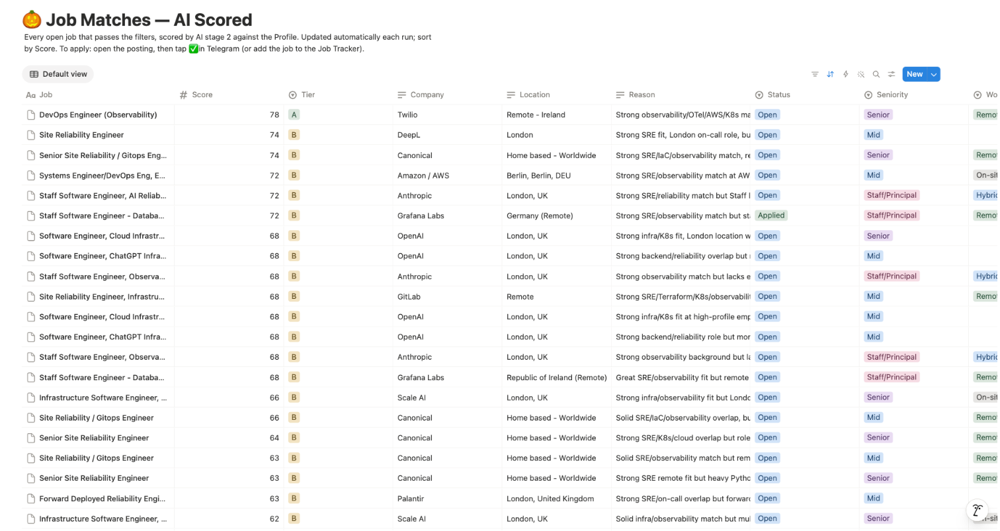
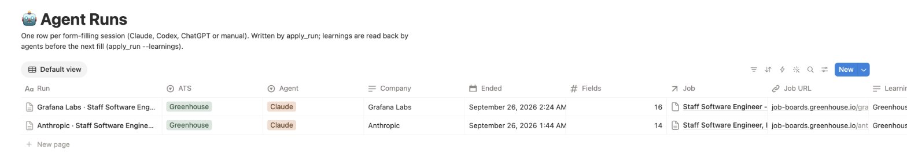
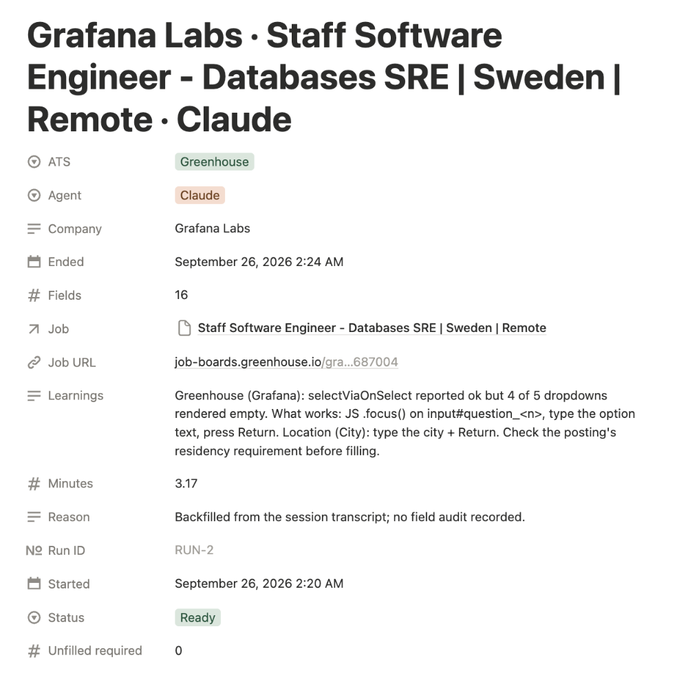
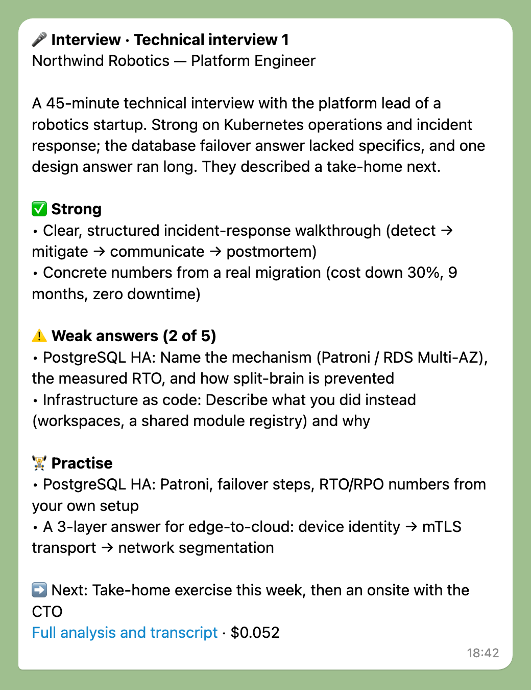
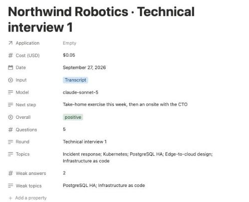
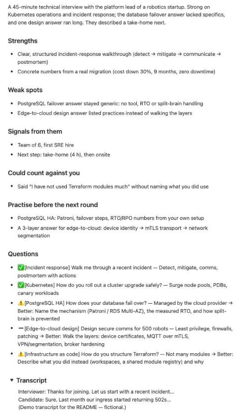
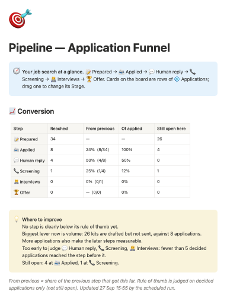
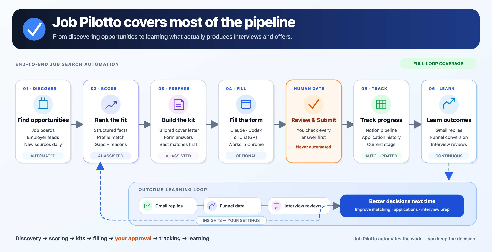

# Job Pilotto

Job-search automation for SRE / platform / DevOps roles. Fork it, point it at your own places,
languages and CV, and it crawls job boards and employer feeds every 4 hours, has Claude score each
posting against your profile, drafts a cover letter and form answers for your best matches, and
sends a ranked digest to Telegram. Applications are tracked in Notion. **It never submits an
application on your behalf** — drafting and filling can be automated; clicking Submit always stays
with you.

**Not a developer?** Use the free [Mac app](#mac-app): a guided setup in about ten minutes, no
terminal, with a Chrome extension that fills the forms. Website:
[job-pilotto-site.sre-watch-bot.workers.dev](https://job-pilotto-site.sre-watch-bot.workers.dev/)
([every feature](https://job-pilotto-site.sre-watch-bot.workers.dev/#features),
[compared with Simplify, Teal, Huntr, JobCopilot and LazyApply](https://job-pilotto-site.sre-watch-bot.workers.dev/compare.html)).

<p align="center">
  
</p>

<sub>Discover → rank with Claude → deliver to Telegram and Notion → you submit → learn from every reply.
Diagram source: <a href="docs/images/architecture.svg"><code>docs/images/architecture.svg</code></a>.</sub>

Everything in that diagram except the crawl is **optional**. You can run the core in two minutes
with no accounts and no keys, then turn on the rest one piece at a time, only if you want it.

## Quick start (no accounts, no keys)

Needs Python 3.10+ and nothing else: the core uses only the standard library.

```bash
git clone https://github.com/<you>/job-pilotto && cd job-pilotto
python3 -m src discover     # job boards (jobs.ch, TechTree): their jobs, and new employers to watch
                            # (SwissDevJobs is tried too, but it blocks automated access)
python3 -m src daily        # crawl every employer feed, add the board jobs, rank, print the digest
python3 -m src feeds        # the employer-feed crawl as a filterable page: reports/latest.html
python3 -m src doctor       # what's on, what's optional, and the one next step
```

Without Notion, `daily` crawls the employer feeds in `config/sources.json`: a shared starter list
of 29 verified public feeds (Anthropic, OpenAI, Stripe, Datadog, Grafana Labs, Cloudflare, GitLab,
Databricks and more, about 9,000 open jobs), so the first run already has plenty to rank. Your
`config/search.json` then keeps only the titles and places you want. With Notion, `daily` also
crawls every Active row of your Employers & Sources database, which the source scout keeps
growing. Make it yours by editing `config/search.json` (job titles, places, tech keywords; see
[Configuration](#configuration)) and `config/sources.json` (employer feeds to crawl). That's a
working job search. Everything below is an upgrade you can skip.

## Optional features

Each feature turns itself on when the keys or variables it needs are set, and stays off
otherwise. Nothing fails because a feature is missing: `python3 -m src doctor` just shows it as off.

| Feature | What you get | Needs | Cost | Effort |
|---|---|---|---|---|
| `discover` | jobs.ch + TechTree employers and jobs | nothing | free | on by default |
| `scout` | daily search for new employer feeds to crawl | nothing (Notion to keep them) | free | on by default |
| `telegram` | the digest on your phone | `TELEGRAM_BOT_TOKEN`, `TELEGRAM_CHAT_ID` | free | 5 min |
| Scheduled runs | a crawl every 4 hours without your laptop | a GitHub fork with Actions on | free | 5 min |
| `notion` | Applications tracker, Job Matches, run log | `NOTION_TOKEN` + the pages in [docs/notion-schema.md](docs/notion-schema.md) | free | 30 min |
| Telegram buttons | ✅ applied / ⭐ save / ➕ next, `/run`, `/add` | Cloudflare Worker (`worker/setup.sh`) | free | 15 min |
| `enrich` | AI facts: languages, seniority, salary, visa | `ANTHROPIC_API_KEY`, `JOB_PILOTTO_ENRICH_MODEL` | ~$0.004/job | 2 min |
| `score` | AI fit score against your Profile | + `JOB_PILOTTO_SCORE_MODEL`, Notion | ~$0.01/job | 2 min |
| `auto_kits` | cover letter + form answers for top matches | + `JOB_PILOTTO_AUTO_KIT_MAX`, Notion | ~$0.04/kit | 2 min |
| `insights` | daily insight + Monday weekly report | + `JOB_PILOTTO_INSIGHT_MODEL`, Notion | ~$0.03/day | 2 min |
| `google_jobs` | Google Jobs listings via [SerpApi](https://serpapi.com) | `SERPAPI_API_KEY` | free plan: 250 searches/month | 5 min |
| `mail` | Gmail + Calendar update your applications | Google OAuth client + sign-in, Notion, Anthropic | a few cents/day | 15 min |
| Mac app | guided setup, job list, Apply / Prepare / Tailor CV buttons, schedules, notifications | a Mac (Apple silicon) | free | 10 min |
| Chrome extension | fills the form from its kit in seconds, you Submit | Chrome + the Mac app (or the Worker; [extension/README.md](extension/README.md)) | free | 5 min |
| Tailored CV | a version of your CV per job, every change highlighted | the Mac app, `ANTHROPIC_API_KEY` | ~$0.12/CV | 1 min |
| Apply with Claude (recommended) | from the job board through the employer's sign-up to a filled form, you Submit | the Mac app, Claude Code, Notion; Gmail for confirmation emails | your Claude plan | 5 min |
| `transcribe` | interview recordings → transcript with speakers, on your machine | `pip install -r requirements-transcribe.txt` (bundled in the Mac app) | free (models ~520 MB, downloaded once) | 2 min |
| Form filling by an AI agent | an AI agent fills the form in Chrome, you Submit | a Mac, Claude Code or Codex, Chrome | your AI plan | 10 min |

A sensible order: Telegram and scheduled runs first (free, 10 minutes), then Notion, then the AI
stages if the ranking is worth paying for. The paid features only cost money once you add a key.
The AI stages also stop at your monthly budget (`JOB_PILOTTO_MONTHLY_BUDGET_USD`).

**Turning a feature off without deleting its keys:** list it in `JOB_PILOTTO_DISABLE`,
comma-separated, or `all` for the core only.

```bash
echo 'JOB_PILOTTO_DISABLE=google_jobs,mail' >> .env               # local runs
gh variable set JOB_PILOTTO_DISABLE --body 'google_jobs,mail'     # scheduled runs on GitHub
gh variable delete JOB_PILOTTO_DISABLE                            # everything back on
```

The names are the ones in the first column (`discover`, `scout`, `telegram`, `notion`, `enrich`,
`score`, `auto_kits`, `insights`, `google_jobs`, `mail`, `transcribe`), and `src/features.py` defines them. A
switched-off feature behaves exactly as if its keys were missing, and `doctor` lists it under
"switched off".

## What you get

### 🔎 Finding jobs
- 🕷️ **Crawls every 4 hours** on GitHub Actions: jobs.ch, TechTree and employer feeds (Greenhouse,
  Lever, Ashby, Workable, Recruitee, Personio, SmartRecruiters, Amazon, Netflix), plus Google Jobs
  through SerpApi's paid API when `SERPAPI_API_KEY` is set (one search per crawl, rotating queries).
- 🛰️ **Source scout**: once a day it checks new candidate employers (seed companies, Hacker News
  "Who is hiring?", open company lists, jobs.ch employers) for a public job feed, scores its quality
  and adds the useful ones to the crawl.
- 🌍 **Filters**: only your preferred places (or remote); jobs requiring a language you don't speak
  are hidden; applied and dismissed jobs never come back; jobs gone for 7 days are closed.

### 🧠 AI that reads every posting
- 🔬 **Stage 1 — facts** (Claude Haiku 4.5): languages, seniority, work mode, salary, recruiter vs
  employer, visa sponsorship — each with a quote from the posting as evidence.
- 🎯 **Stage 2 — fit score** (Claude Sonnet 5): 0–100 against your Notion Profile, a tier (A/B/C)
  and a one-line reason. Edit your Profile and every open job is re-scored.
- 🛂 **Visa badges**: 🔴 when you'd need sponsorship (or the posting rules it out), 🛂 when the
  posting offers it — without lowering the score.
- 📝 **Application kits**: for your best new matches, Claude drafts a short cover letter in your own
  voice and one answer per real form question (read from the employer's form), flags anything it
  isn't sure about instead of guessing, and saves it to the job's Notion row.

### 📬 Telegram
- 📊 **Digest**: top 10 jobs per message, best matches first, rotating between digests, with score,
  company, place, seniority, work mode, language and salary signals.
- 👆 **Buttons**: ✅ Applied · ⭐ Save · ❌ Dismiss · 📝 Prepare application kit · ➕ Next 10.
- 📈 **Outcome buttons**: `/applied` lists your applications; tap a number when you hear back →
  📬 Confirmed · 📞 Screening · 🗓 Interview · 🎤 Interviewing · 🎉 Offer · ❌ Rejected · 💤 No reply.
  A reply that isn't a stage yet (a recruiter inviting you to book a call) is logged as "Reply received".
- 💡 **One insight a day** and a 📊 **weekly report** on Mondays (see below), with 👍 Useful · 👎 Not
  useful · ✅ I'll act on it.
- 🎤 **Interviews**: send the recording (a voice note, audio or video up to 20 MB) or the transcript file
  with a caption ("Grafana, round 1"), or `/interview` with your notes, and get back what went well, the
  weak answers and what to practise. Recordings are transcribed with speakers first (see below).
- 📥 **Applied elsewhere?** `/add <job URL> [date]` tracks it too, e.g. `/add https://… on or before 23 Sep`:
  title, company and location come from the posting page.
- 📧 **Gmail and Calendar** (read-only): confirmations, replies, interview invites and rejections update
  your applications by themselves; the evening before an interview you get a prep message.
- ⌨️ **Commands**: `/run`, `/today`, `/applied`, `/saved`, `/add`, `/mail`, `/insight`, `/weekly`, `/interview`, `/scout`, `/status`, `/help`.

### 🤖 Filling applications (macOS)
- 🚀 **Three launchers, one CLI**: ChatGPT desktop, Codex CLI + Playwright, or Claude Code + Claude
  in Chrome — each takes job URLs, `-f jobs.txt` or `--max N` and fills the real form from the kit.
- ⚡ **Fast-path form helpers** (`tools/browser-form-fastpath.js`): map the form once, fill every
  plain field in one call, audit what's missing, click dropdown options by live coordinates.
- 🛡️ **Never submits**: an in-page guard blocks Submit and legal-consent clicks while an agent works;
  you review and click Submit yourself, every time.
- ✅ **Auto-marked applied**: when the confirmation page appears in Chrome, the job moves to Applied
  in Notion by itself, whichever launcher filled it.
- 🔍 **Every run recorded** in a Notion 🤖 Agent Runs database — Claude and Codex, one row per
  session, linked to its job: status, minutes, per-step timing, field-by-field ✓/CHECK, tokens,
  what it was billed to, and a learning. Each kit's exact API cost is on its job's row.
- ⏰ **Every cronjob run reported** in a Notion ⏰ Cronjob Runs database — one row per scheduled
  crawl: feeds, new/changed jobs, AI work per stage, its exact cost (Haiku enrich, Sonnet score,
  auto kits), Telegram outcome, a link to the GitHub run and a short written report. Written by
  code from the run's numbers, so the report itself costs nothing.
- 🩺 **Readiness and health check** (`python3 -m src doctor`): a checklist from setup to "kit ready" that
  names the one next step, so a newcomer never hits an empty launcher without knowing why. Its health
  section (Google sign-in and when it expires, the mail checks, the AI budget, feeds failing in the
  last crawl) also runs every morning and sends one Telegram line only if something is wrong
  (`doctor --alert` runs it now).
- 💸 **AI budget guard**: month-to-date AI spend against your Anthropic monthly limit
  (`JOB_PILOTTO_MONTHLY_BUDGET_USD`). A Telegram alert at 70%; at 90% the scheduled crawl pauses
  auto-kits and caps scoring, so mail checks, insights and interview reviews keep working until the
  limit resets. Spend comes from Anthropic's cost report when you add an Admin API key
  (`ANTHROPIC_ADMIN_KEY`; organization accounts only), otherwise from ⏰ Cronjob Runs, where every AI
  job (crawls, kits, insights, interviews, mail) logs its cost.
- 🧠 **Self-improving**: agents read recent learnings for that job board before filling
  (`python3 -m src.ai.apply_run --learnings Greenhouse`), so each run makes the next one better.

<a id="mac-app"></a>

### 🖥️ The Mac app
- 🧭 **Guided setup, no terminal**: AI key, your copy of the Notion workspace (found and connected by
  itself), your CV, and what you're looking for in plain words; Claude drafts your search strategy
  (roles, places, board searches, hidden languages) for you to edit. Every step is saved as you go.
- 📋 **Jobs**: every open job with its fit score and reason, links to its kit and posting in Notion,
  and one main button per job: **Prepare** (draft the kit) → **Apply with Claude** (recommended, see
  below) or **Fill in Chrome** (the extension fills the form) → **Opened in Chrome**. Without Claude
  Code the button is simply **Apply** (the extension). A ⛔ badge shows the kit's eligibility verdict on hover.
- ✍️ **Answer once**: questions a form asked that your answers don't cover yet, listed once; your
  answer goes to your standard answers in Notion and every later form uses it.
- 🎙️ **Interviews**: record a call (after ticking that everyone agreed) or add a recording → a transcript
  with speakers, made on the Mac → name them, pick the job → **Save to Notion** (optionally **Review**). [More](#-learning-from-your-applications).
- ⏱️ **How often**: per job (search, kits, insights, new employers, mail), in your time zone.
- ☁️ **Keep working while my Mac is off**: sign in with GitHub (a GitHub App with access to one
  repository only) and the app sets up your own private repository with the schedules, secrets and
  settings; searches then run there even with the Mac off.
- 🔔 **Notifications**: kit ready, form filled, application marked applied (an in-window toast when
  macOS blocks them). Keys are encrypted with your Mac's Keychain; data stays in your folder and Notion.

<a id="apply-with-claude"></a>

### 🧭 Apply with Claude (recommended)
Many postings don't end in a form: jobs.ch's Apply leads to the employer's careers site, which has its
own **Apply now**, then a sign-in page, then several form pages. The extension stops there; Claude
doesn't.
- 🖱️ **One button** on a job in the Mac app (or "Apply to jobs…" for several) starts a Claude Code
  session in Terminal that drives your Chrome with Claude in Chrome, from the posting to the last form page.
- 🔑 **Creates the employer account** when a site asks for one, with your details from the CV. The
  password is generated straight into your Mac's Keychain (`job-pilotto.<site>.password`) and pasted
  from the clipboard: it never appears in the session, the logs or Notion. Next time it signs in with it.
- 📧 **Confirms the account itself**: reads the confirmation email's code or link from Gmail
  (read-only, connected in Settings → Gmail and Calendar).
- 🙋 **Asks you only for what it must not do**: the CAPTCHA and the terms boxes. You get a notification,
  one line in Terminal says what to tick, and it carries on.
- 🛡️ **Never presses Submit.** It stops on the review page; you read it and submit.
- ⚡ **Teams up with the extension**: on a form the extension knows, Claude hands it over for the fast fill
  (kit answers, details, CV, dropdowns in seconds), then fills only what's left. Needs the app open (it
  issues a one-time ticket per job, so a web page can't trigger a fill by itself).
- Needs Claude Code (your Claude plan) and Notion (where the kit lives). Minutes per job, versus seconds
  for the extension on a form that's right on the page.

### 🧩 Chrome extension
- ⚡ **Fills from the kit in seconds**: text fields, dropdowns (real clicks, including searchable ones),
  phone country from your number's prefix, city type-ahead boxes, checkbox questions, demographic
  surveys (the "decline" option unless your profile says otherwise), your CV and the cover letter.
- ✅ **Live checklist on the page**: what's left, grouped (legal choices, answers, dropdowns to click,
  answers to read), updated as you fill, green "Ready to submit" at the end. Answers written by AI are
  outlined so you read them first.
- 🖐️ **Never presses Submit.** Terms and consent boxes are ticked only with the "Tick terms and consent
  boxes for me" setting or the checklist's "Accept all" button.
- 🔗 **Follows the Apply hop**: a job board's Apply that opens the employer's own form (jobs.ch → the
  employer's site) fills with the same job's kit; any other site works with one click on the icon, or
  automatically with the "every job site" permission.
- 🧠 **Learns per job site**: after a fill that left fields, Claude Haiku writes short reusable notes
  for that site (about 1¢ per site, once), used on every later form there. With "Help improve Job
  Pilotto" on, the *structure* of a field it couldn't operate (never your answers) becomes a GitHub
  issue that a daily Claude Code run turns into a tested fix.
- 📋 **Every fill logged** to 🤖 Agent Runs in Notion with a field-by-field table and debug data, and
  the job is marked Applied when the confirmation page appears.

### 📄 Tailored CV per job
- ✂️ **Tailor CV** on a job: one Claude Sonnet 5 call reorders your bullets toward the posting, rewords
  them in its vocabulary, may drop up to two irrelevant ones per role and rewrites the summary
  (measured: about $0.12 and 1–2 minutes per CV).
- 🛡️ **Only your facts, checked by code**: same jobs, titles, dates and places; a reworded bullet that
  changes a number keeps its original wording; tools or terms found nowhere in your CV or Profile are
  flagged; skills lines may only be reordered.
- 🔍 **Review window**: the tailored CV with reworded words (old → new), moved and dropped bullets
  highlighted, next to what changed and why; "Hide highlights" shows it clean; "Open the PDF".
- 🎨 **Your CV as data, your design kept**: the first time, Claude reads your CV PDF into `cv/cv.json`
  (edit it freely); a clean default template prints it, or your own `cv/style.css` (the owner's is
  rebuilt from their Figma file, with fixed pages and an overflow check). Chromium prints the PDF with
  selectable text.
- 📤 **Used when you apply**: the extension uploads the tailored CV on that job's form (same file name),
  your base CV everywhere else.

### 📈 Learning from your applications
- 🧊 **Every application frozen when you apply**: the job description, AI facts and fit score,
  every question with the answer you actually submitted (read from the form just before Submit),
  the kit draft it came from (✏️ when you changed it), the cover letter, CV version and agent.
- 📅 **Every outcome with its date** in a 📈 Application Events database: from the `/applied`
  buttons, Stage edits in Notion, and an automatic "No response" after 30 days of silence.
- 💡 **A daily insight** on Telegram, kept in a 💡 Insights database: code computes the numbers
  (technologies your best-fit jobs ask for that your CV doesn't show, where the eligible jobs are,
  what blocks you, and — once there are enough applications — which groups get replies), then
  Claude Sonnet 5 picks the one finding worth acting on today. About USD 0.03 a day. Findings about
  why applications fail wait until a group has at least 10 applications. Your 👍/👎/✅ steer the next ones.
- 📊 **A weekly report** every Monday instead of the daily insight: the week's applications and
  replies, how the market moved, how you rated the week's insights, what worked and up to three
  changes for next week. The full report (with the numbers) is a page in 💡 Insights; Telegram
  gets the summary and a link. About USD 0.04 a week.
- 🎙️ **Interview transcription** (the app's **Interviews** page, `src/ai/transcribe.py`): free, on your Mac.
  - **In:** record the call in the app (your mic + the call's audio via [AudioTee](https://github.com/makeusabrew/audiotee),
    macOS permission **System Audio Recording Only**), or add a recording (`.m4a`, `.mp3`, `.webm`, video…).
  - **Out:** a transcript with **who said what**; your own voice is labelled **You**.
  - **Saved to Notion** 🎤 Interviews, linked to any job you pick or paste (added to Applications if new; relink any time).
  - **Delete** a draft, or a saved row (Notion trash, 30 days) with its recording. Only the audio stays on the Mac.
  - **Open source**, run with [sherpa-onnx](https://github.com/k2-fsa/sherpa-onnx): Parakeet-TDT v2 (English) +
    pyannote 3.0 / 3D-Speaker for speakers. ~1 min per 10 min of audio on an M1; models (~520 MB) download once.
  - **Phone:** send a voice note to the bot; it's transcribed the same way in GitHub Actions.
  - ⚠️ **Ask everyone first.** The app won't record until you confirm they agreed: recording without
    consent is illegal in Switzerland (Art. 179ter StGB) and many other places.
- 🎤 **Interview reviews**: from the Interviews page (**Review**, or **Save and review**), or send a
  recording, a transcript (`.txt`, `.md`, `.srt`, `.vtt`) or your notes to the bot.
  Claude Sonnet 5 links it to the right application, lists every question by topic with how you
  answered (strong / ok / weak, and what a stronger answer would add), strengths, weak spots, what
  they revealed, the next step and what to practise. It's saved in a 🎤 Interviews database (with
  the full transcript), logged as an Interviewing event, and the insights start tracking topics that
  keep coming up or keep being answered weakly. About USD 0.05 per interview.
  Recruiters who record calls often offer the transcript by email ("Download transcript: …"); the Gmail
  check points those out. See the screenshots below.
  A review of a saved transcript is added to that same Notion page, above the transcript.
- 📧 **Gmail and Calendar, read-only** (`src/ai/mail.py`, workflow `mail.yml`): 3 times a day (07:00,
  12:00, 18:00 Zurich; edit the cron to change it), 5 minutes after an application is marked Applied,
  and on `/mail`. Recent mail from applicant-tracking systems, recruiter platforms and schedulers (or
  naming a tracked company) is classified by Claude Haiku 4.5 (about USD 0.002 per email) and matched
  to its application: confirmations, replies, interview invites, rejections and offers become dated
  📈 Application Events (never twice: each keeps its Gmail message id), Stage moves forward and Next
  interview is filled. Calendar events belonging to an application (company, platform, or a contact's
  email among the attendees) do the same; the evening before and the morning of an interview you get a
  prep message (time, link, who, topics you answered weakly before), and afterwards a nudge to send the
  transcript. Nothing in Gmail or Calendar is ever changed. Setup below.
- 🎯 **Funnel and where to improve**: a 🎯 Pipeline page in Notion shows how many applications
  reached each step (Prepared → Applied → Human reply → Screening → Interviews → Offer), the
  conversion between steps and what is still open, plus a board of every application by Stage. A
  "Where to improve" box names the step below its rule of thumb once at least 5 applications are
  decided there (`src/notion/funnel.py`, refreshed by every scheduled run, no AI cost). The daily
  insight gets the same numbers.
- 🧭 **How you applied counts**: each application has a Channel (Direct, Recruiter platform, Agency,
  Referral) and Via (e.g. TechTree), detected from the job URL; Company always holds the real
  employer, even when a platform reveals it only later. Insights compare reply rates by channel and
  track days to first reply.
- 🧾 **Existing applications included**: `python3 -m src.notion.ledger backfill` records every
  application tracked before the ledger existed.

### 🗂️ Tracking in Notion
- 📋 Job Matches (every scored job, with its technologies and role family), Applications — Job
  Tracker (with the frozen application record), 📈 Application Events, 🎤 Interviews, 💡 Insights, 🎯 Pipeline (funnel), Employers & Sources.
- 👤 Profile and Application Answers pages — the single source for the scorer, the kit drafter and
  every form filler. Answer a question once and it's reused on every form.

### 🔐 Private by default
- 🔑 Secrets in the macOS Keychain, GitHub secrets and Cloudflare Worker secrets — never in the repo.
- 🧾 CV, `.env` and run traces stay on your machine (git-ignored).

## Screenshots

**Job Matches — AI Scored** (Notion): every open job that passes your filters, scored against
your Profile, with tier and a one-line reason.



**🤖 Agent Runs** (Notion): one row per form-filling session, linked to its job.



**One run**: timing, fields audited, status, and the learning the next run reads before filling.



**🎤 Interview review** (Telegram): send the transcript to the bot with a caption such as "Northwind
Robotics, technical 1"; a minute later you get what went well, the weak answers with what a stronger
answer would add, what to practise, and the next step. *(Screenshots use a fictional interview.)*



**🎤 Interviews** (Notion): one page per interview, linked to its application: round, overall
impression, the topics asked and the ones answered weakly (counted across interviews by the daily
insight and the evening-before prep message)…



…then the full review: strengths, weak spots, what they revealed, what could count against you,
what to practise, every question marked ✅ strong · ➖ ok · ⚠️ weak with a better answer, and the
transcript.



**🎯 Pipeline** (Notion): conversion between funnel steps and the step to improve, refreshed by
every scheduled run. Below it on the page (not shown): a board of every application by Stage and a
live chart.



## How Job Pilotto compares

Job Pilotto is for people who want a self-managed pipeline they control end to end: public job
feeds, explicit location and language filters, evidence-based match scores, reviewable application
kits, Telegram triage, Notion tracking — and browser agents that fill the form but **never submit
it**. Compared from each project's published features and source code, September 2026; this is not
a measured accuracy or success-rate benchmark.

**Legend:** ✅ yes · ⚠️ partial or experimental · ❌ no · ➖ not described in its public docs

| | 🦾 **Job Pilotto** | [JobCopilot.com](https://jobcopilot.com/) | [Job-CoPilot.ai](https://job-copilot.ai/) | [suxrobGM/jobpilot](https://github.com/suxrobGM/jobpilot) | [jsmastery-pro/JobPilot](https://github.com/jsmastery-pro/JobPilot) | [BhairavJShah/JobPilot-AI](https://github.com/BhairavJShah/JobPilot-AI) | [arthurpanhku/job-pilot](https://github.com/arthurpanhku/job-pilot) |
|---|:-:|:-:|:-:|:-:|:-:|:-:|:-:|
| 🔓 Open source, self-hosted | ✅ | ❌ | ❌ | ✅ | ✅ | ✅ | ✅ |
| 🕷️ Automatic job discovery | ✅ | ✅ | ✅ | ➖ | ✅ | ➖ | ✅ |
| 🛰️ Finds new employer feeds by itself | ✅ | ➖ | ➖ | ➖ | ➖ | ➖ | ➖ |
| 🎯 AI fit score against your profile | ✅ | ➖ | ✅ | ➖ | ➖ | ➖ | ➖ |
| 🌍 Location, language and visa filters | ✅ | ➖ | ➖ | ➖ | ➖ | ➖ | ➖ |
| ✍️ Cover letter and form answers per job | ✅ | ➖ | ✅ | ➖ | ➖ | ➖ | ➖ |
| 📄 Tailored CV per job | ✅ | ✅ | ✅ | ➖ | ✅ | ➖ | ✅ |
| 🔍 Every CV change shown and fact-checked | ✅ | ➖ | ➖ | ➖ | ➖ | ➖ | ➖ |
| 🖥️ Desktop app with guided setup | ✅ | ➖ | ➖ | ➖ | ➖ | ➖ | ➖ |
| 🧠 Learns each job site's forms | ✅ | ➖ | ➖ | ➖ | ➖ | ➖ | ➖ |
| 💾 Saved answer vault, reused on every form | ✅ | ➖ | ➖ | ➖ | ➖ | ✅ | ➖ |
| 🤖 Fills real application forms | ✅ | ✅ | ❌ | ✅ | ⚠️ | ✅ | ⚠️ |
| 🔑 Gets through employer sign-up (account, email confirmation) | ✅ | ➖ | ➖ | ➖ | ➖ | ➖ | ➖ |
| 🧰 Choice of filler (Chrome extension, ChatGPT, Codex, Claude) | ✅ | ❌ | ❌ | ⚠️ | ❌ | ❌ | ❌ |
| 🛡️ You always click Submit (enforced) | ✅ | ⚠️ | ➖ | ❌ | ➖ | ❌ | ➖ |
| 🔍 Post-fill field audit | ⚠️ | ➖ | ➖ | ➖ | ✅ | ✅ | ➖ |
| 📱 Mobile triage (Telegram buttons) | ✅ | ➖ | ⚠️ | ➖ | ➖ | ➖ | ➖ |
| 📋 Application tracking | ✅ | ➖ | ✅ | ✅ | ➖ | ➖ | ➖ |
| 📬 Reads Gmail and Calendar to update each application | ✅ | ➖ | ➖ | ✅ | ➖ | ➖ | ➖ |
| 🗂️ Record of what was sent (questions, answers, CV version) | ✅ | ➖ | ➖ | ➖ | ➖ | ➖ | ➖ |
| 📊 Outcome analytics: funnel conversion, what to improve | ✅ | ➖ | ➖ | ✅ | ➖ | ➖ | ⚠️ |
| 🎤 Interview review from a transcript or notes | ✅ | ⚠️ | ⚠️ | ➖ | ➖ | ➖ | ➖ |
| 💸 Your own AI budget cap and health alerts | ✅ | ➖ | ➖ | ➖ | ➖ | ➖ | ➖ |
| ✅ Marked applied automatically on submit | ✅ | ➖ | ➖ | ➖ | ➖ | ➖ | ➖ |
| 🔔 Desktop notifications (started, ready, submitted) | ✅ | ➖ | ➖ | ➖ | ➖ | ➖ | ➖ |
| 🚀 High-volume unattended applying | ❌ | ✅ | ❌ | ✅ | ⚠️ | ✅ | ⚠️ |
| 📈 Published cross-ATS fill-accuracy numbers | ❌ | ➖ | ➖ | ➖ | ⚠️ | ➖ | ➖ |

Notes on the rows: Job-CoPilot.ai sends alerts rather than triage buttons; suxrobGM/jobpilot runs
Claude or Codex, reads Gmail replies and shows pipeline analytics; JobCopilot.com (AI mock interviewer)
and Job-CoPilot.ai (prep from the job description) help before an interview but don't review one that
happened; arthurpanhku's dashboard shows success rates; jsmastery-pro's [form-filling report](https://github.com/jsmastery-pro/JobPilot/blob/main/BROWSERBASE_REPORT.md)
documents wrong-field fills on external ATS forms; BhairavJShah's
[autofiller](https://github.com/BhairavJShah/JobPilot-AI/blob/main/automation/form_autofiller.py)
submits when no doubts remain; arthurpanhku's
[Indeed automation](https://github.com/arthurpanhku/job-pilot/blob/main/backend/app/automation/indeed.py)
still has form-fill and submit placeholders. Job Pilotto's audit is ⚠️: every Codex and Claude run is
recorded with a page-derived verdict (guard on, required fields filled, no legal box ticked,
résumé attached; `python3 -m src.ai.apply_run --status` / `--report <URL>`), but field *values*
aren't yet compared to their sources.

<p align="center">
  
</p>
<sub>Diagram source: <a href="docs/images/pipeline-coverage.svg"><code>docs/images/pipeline-coverage.svg</code></a>.</sub>

**In short:** 🏆 Job Pilotto covers the most of the pipeline — discovery → scoring → kits → filling
→ tracking → learning from outcomes (Gmail replies, funnel, interview reviews) — with you in control of every submission. 🥈 Hosted tools like JobCopilot.com win on
volume and unattended applying; they don't let you own the sources, scoring or final click.
🧪 Other open-source projects worth borrowing from: [jlifeng/JobPilot](https://github.com/jlifeng/JobPilot)
(editable CV variants), [adrianhajdin/job_pilot](https://github.com/adrianhajdin/job_pilot)
(reference stack), [AgentSpan](https://github.com/agentspan-ai/agentspan) (durable agent runs,
now [part of Orkes Conductor](https://orkes.io/blog/open-sourcing-agentspan-durable-ai-agents/)).

**⚠️ Current gap:** form filling is driven by the Chrome extension or browser agents and the kit, not
a verified form engine. The extension fills a Greenhouse form in seconds; the agents have filled forms
for real, submitted applications (all on Greenhouse so far), typically in 2–6 minutes, with an accidental-Submit/consent guard and deterministic helpers for ordinary fields. The
guard is not a security boundary, each run's audit checks that fields are filled (not that values
are right), and cross-ATS accuracy hasn't been measured. Always inspect the filled form before submitting.

## Day-to-day use

**The baseline runs itself — there's nothing to trigger.** Every 4 hours GitHub Actions crawls,
scores, and (if you've turned it on) drafts kits for your best new matches, and Telegram messages
you the result. If nothing new and good enough showed up, `scheduled` mode stays quiet rather than
spamming you. This part needs zero daily action from you.

**Not sure where you are? Run `python3 -m src doctor`.** It checks, in order, that Notion, your
Profile, Answers and CV are set up, that the GitHub schedule, secrets and AI stages are on, that
feeds exist and the last crawl succeeded, that jobs are scored and kits are ready, and that Claude
Code and Chrome are installed — then prints the one next step. It spends nothing and changes
nothing. The launchers print the same next step when there's nothing to apply to.

```
Data
  ✅ Sources: 32 feeds (29 from Employers & Sources)
  ✅ Last crawl: 2.5 h ago
  ✅ Scored jobs: 258 open, 5 scoring 70+
Apply
  ⚠️  Kits ready: no job has a drafted kit, so there is nothing to apply to yet
👉 Next step — Kits ready: Draft kits for your best matches: tools/prepare-top.sh 5  (~$0.04 each)
```

What you actually *do*, day to day, is a mix of two habits:

**1. A couple of minutes, most times you check your phone** — read whatever Telegram sent, and tap
buttons under jobs you care about: **⭐ Save** to keep something for later, **❌ Dismiss** to hide
noise (this also tunes future scoring), **✅ Applied** if you applied outside this system, or
**📝 Prepare** on a good job that didn't get an automatic kit. This is the entire "daily" loop for
most people — no commands, just reacting to what arrives.

**2. A batch session every few days, when you're ready to actually apply** (this is the "I'd spawn
job application automations" part of your question) — on your laptop:
```sh
tools/prepare-top.sh 3            # draft kits for your 3 best matches that don't have one (~$0.04 each)
tools/apply-batch-claude.sh --max 3   # one filling session per job (or apply-batch-codex-terminal.sh / -chatgpt.sh)
```
The launcher picks jobs at **Kit ready** (or ⭐ Saved) **with a kit on it**, skips any posting that
has closed (marking it Closed in Notion), and fills each form in Chrome, stopped before Submit.
🔔 You get a notification when filling starts and a dialog when a form is ready (its **Show window**
button jumps to that session's Terminal). You review and click Submit; a background watcher sees the
confirmation page and marks the job **Applied** in Notion by itself. Each session is recorded in
🤖 Agent Runs, and its learnings are read by the next run. Nothing forces this onto a schedule; run it
whenever you have time to review.

You can also reach for specific Telegram commands on demand, not as a daily ritual:

| When you want | Send |
|---|---|
| A fresh crawl right now instead of waiting for the next 4-hourly run | `/run` |
| The current ranked list without re-crawling | `/today` |
| What you've applied to and their stage | `/applied` |
| Jobs you starred | `/saved` |
| To find new employer feeds outside the daily scout | `/scout` |
| Whether the last few runs succeeded | `/status` |

**Putting it together, a realistic week looks like:** Telegram pings you a few times a day; you
tap ⭐/❌ on maybe a dozen jobs without leaving the app; a couple of times that week you open your
laptop, run `apply-batch-chatgpt.sh` or `apply-batch-claude.sh`, review 3-5 filled forms over
coffee, and submit the good ones — marking them applied happens by itself. The system never applies on its own initiative — it just makes sure that by the time
you sit down to apply, the tedious part (finding the posting, writing the letter, answering the
same 15 form questions again) is already done.

## Prerequisites

**Required: Python 3.10+.** That's all the [Quick start](#quick-start-no-accounts-no-keys) needs.
Everything below is for the [optional features](#optional-features); set up only the ones you want.

**For the full cloud pipeline (every 4 hours, Telegram, Notion, AI), any OS:**

1. A **GitHub account** — fork this repo; Actions must stay enabled.
2. A **Telegram account and bot** — message [@BotFather](https://t.me/BotFather) to create one
   (`TELEGRAM_BOT_TOKEN`); message your new bot once to get your chat ID (`TELEGRAM_CHAT_ID`).
3. A **Cloudflare account** (free tier) — hosts the Worker that turns Telegram commands and button
   taps into GitHub Actions runs. You'll need `npx wrangler` and a GitHub fine-grained personal
   access token (Actions: read + write on your fork) for the Worker to use.
4. A **Notion account and integration** (`NOTION_TOKEN`), with your own copies of the databases and
   pages in **[docs/notion-schema.md](docs/notion-schema.md)** — the exact property names and
   types to create, so you don't have to reverse-engineer them from the source code. In short:
   an Applications database, a Job Matches database, a Profile page, an Application Answers page,
   and (optional) Employers & Sources and 🤖 Agent Runs databases. For the two pages,
   **[docs/notion-profile-template.md](docs/notion-profile-template.md)** has paste-ready copies.
5. An **Anthropic account and API key** (`ANTHROPIC_API_KEY`) — pay-as-you-go; powers fact
   extraction, fit scoring and kit drafting. Skip it and you still get a plain crawler + digest,
   with no scoring or drafting.
6. **Your own CV and profile facts.** There's no way around this being manual — it's what makes
   the scoring and drafting personal to you.

**Optional — local "apply" tooling, macOS only:**

7. A **Mac**, since the launchers (`tools/apply-batch-*.sh`), notifications and the submit watcher
   use `osascript` (Terminal, Chrome, System Events). The core pipeline doesn't need one.
8. The **ChatGPT/Codex desktop app**, signed in, with your terminal app granted **Accessibility**
   permission (System Settings → Privacy & Security → Accessibility).
9. **[Claude in Chrome](https://claude.ai/chrome)** and [Claude Code](https://claude.com/claude-code)
   for `tools/apply-batch-claude.sh` — see `.claude/skills/apply-to-job/SKILL.md`.
   And/or the **Codex CLI** plus the [Playwright MCP Chrome extension](https://playwright.dev/mcp/configuration/browser-extension)
   for `tools/apply-batch-codex-terminal.sh`.
10. **Chrome → View → Developer → Allow JavaScript from Apple Events**, turned on. The submit watcher
    uses it to read the questions and answers on the form you're about to submit (read only, only
    that job's tab), so the application record holds what you actually sent. Without it, the
    record falls back to the kit's drafted answers and is marked "Kit draft". Trade-off: any app
    you've allowed to control Chrome through Apple Events can then run scripts in your tabs.
11. Nothing extra for notifications: "Form filled" and "Needs your input" open a native dialog
    whose **Show window** button raises that session's Terminal window; the rest are banners.

None of group two is required for the core pipeline; it only matters if you want the same
"queue kits into an AI browser agent" workflow described above.

## Configuration

**Running locally**: on macOS, the maintainer's own scripts (`tools/apply-batch-*.sh`) read
`NOTION_TOKEN` from the Keychain entry `job-pilotto.notion.token` if it's not already exported.
Everywhere else — another OS, CI, or if you'd rather not use Keychain at all — copy
`.env.example` to `.env` and fill in real values; `src/paths.py` loads it automatically (no
library, no manual `source` step) the first time any part of this project runs, without
overriding a variable your shell already has set. `.env` is git-ignored, never committed.

**GitHub repository secrets** (Settings → Secrets and variables → Actions):
`TELEGRAM_BOT_TOKEN`, `TELEGRAM_CHAT_ID`, `NOTION_TOKEN`, `ANTHROPIC_API_KEY`; optionally
`SERPAPI_API_KEY` to add Google Jobs (SerpApi charges per search; see `google_jobs` below).

**GitHub repository variables**, all optional, everything is off by default:

| Variable | Effect |
|---|---|
| `NOTION_APPLICATIONS_DB` | your Applications database ID |
| `NOTION_PROFILE_PAGE_ID` | your Profile page ID |
| `NOTION_MATCHES_DB` | your Job Matches database ID |
| `NOTION_ANSWERS_PAGE_ID` | your Application Answers page ID |
| `NOTION_EMPLOYERS_DB` | your Employers & Sources database ID (optional — the crawler falls back to `config/sources.json` without it) |
| `NOTION_CRON_RUNS_DB` | your ⏰ Cronjob Runs database ID (optional — without access the run just logs a warning) |
| `NOTION_EVENTS_DB` | your 📈 Application Events database ID (outcome history: Applied, Screening, Rejected, ...; written by the ✅/`/applied` buttons, `mark-applied` and the scheduled sync) |
| `NOTION_AGENT_RUNS_DB` | your 🤖 Agent Runs database ID (optional — form-filling runs are still recorded locally without it) |
| `JOB_PILOTTO_ENRICH_MODEL` | e.g. `claude-haiku-4-5` — turns on AI stage 1 |
| `JOB_PILOTTO_SCORE_MODEL` | e.g. `claude-sonnet-5` — turns on AI stage 2 |
| `JOB_PILOTTO_KIT_MODEL` | model for 📝 Prepare (defaults to `claude-sonnet-5` if unset) |
| `JOB_PILOTTO_AUTO_KIT_MAX` | auto-draft kits for up to N best new matches per crawl (0/unset = off) |
| `JOB_PILOTTO_AUTO_KIT_MIN_SCORE` | minimum fit score to qualify (default 50) |
| `JOB_PILOTTO_INSIGHT_MODEL` | model for the daily insight (repository variable; unset = no insights). Uses `claude-sonnet-5` |
| `NOTION_INSIGHTS_DB` | your 💡 Insights database ID |
| `NOTION_INTERVIEWS_DB` | your 🎤 Interviews database ID |
| `GOOGLE_CLIENT_ID`, `GOOGLE_CLIENT_SECRET`, `GOOGLE_REFRESH_TOKEN` | GitHub secrets for Gmail + Calendar (read-only), set by `python3 -m src.sources.google auth --github`; locally in the Keychain (`job-pilotto.google.*`) |
| `JOB_PILOTTO_MAIL_MODEL` | model that classifies job emails (repository variable; default `claude-haiku-4-5`) |
| `JOB_PILOTTO_TZ` | your time zone for reminders (default `Europe/Zurich`) |
| `JOB_PILOTTO_MONTHLY_BUDGET_USD` | your Anthropic monthly spend limit, for the budget guard (repository variable; default 15) |
| `ANTHROPIC_ADMIN_KEY` | optional Admin API key (`sk-ant-admin…`, GitHub secret or Keychain `job-pilotto.anthropic.admin-key`): exact monthly spend from Anthropic's cost report |
| `JOB_PILOTTO_GOOGLE_AUTH_AT` | when you last signed in to Google (set by `google auth --github`); the health check warns before the 7-day Testing limit |
| `JOB_PILOTTO_INTERVIEW_MODEL` | model for interview reviews (default `claude-sonnet-5`) |
| `DIGEST_BRAND_NAME` | your digest's display name (default `Job Pilotto`) — the tool's own name stays generic; this is what your Telegram messages say, e.g. `"SRE Job Pilotto"` if you want to keep your own role in the name |

Delete `JOB_PILOTTO_ENRICH_MODEL`/`JOB_PILOTTO_SCORE_MODEL` at any time to stop all AI spending.

`config/preferences.json`, `config/sources.json` and `config/scout_seeds.json` hold your hard
filters, always-crawled employer feeds and scout candidate companies — edit these to your own
target places, languages and employers. `preferences.json` also sets `digest_min_score` (default 50):
scored jobs below it stay in Notion Job Matches but never take up space in the Telegram digest
(jobs you ⭐ saved always show; unscored jobs show too, so the digest works without AI).

`config/sources.json` is the **shared starter list**: public facts only (company, ATS, board slug,
open jobs, date checked). Tiers, ratings, research notes and anything about your applications
stay in your own Notion. Add or delete entries freely; a feed that stops answering is only logged
as a failing feed, never breaks the crawl. To refresh the list from your Employers & Sources
database (the maintainer does this, and a fork can too), run
`python3 -m src scout --export-sources`. It fetches each Active feed once, leaves out any that
don't answer, and rewrites the file.

**`config/search.json` is what makes this a general-purpose job search, not an SRE-in-Switzerland
one.** It holds every role, location and tech-stack keyword the code uses to decide what counts as
a relevant job and where: `role_keywords` (job titles you want), `title_exclude_keywords` (titles
that contain a role keyword but are a different job, such as "Infrastructure Tax Lead" or "SAP ABAP
Developer"; dropped from feeds, job boards and Google Jobs before any AI step), `board_discovery_keywords`
(broader terms for jobs.ch discovery), `jobs_board_search_queries` (the literal search terms run
against jobs.ch), `quality_stack_keywords` (tech terms the scout uses to judge a new employer feed),
and `locations.{top_tier,country_wide,abroad}` / `remote_excluded_regions` (your preferred places
and which "remote" postings don't actually include you). `google_jobs` holds plain (not regex)
`queries`, the `country` code and `locations` for Google Jobs. Each location is a SerpApi canonical
name with the place's own `language`: Google Jobs returns nothing for Zurich in English, but does
in German. It also sets how many paid searches a crawl may make (`searches_per_run`, rotating
through every query × location pair) and how many SerpApi credits to leave untouched
(`min_searches_left`). Values are regex fragments (e.g. `"z[uü]rich"`
matches both spellings, `"\\bsre\\b"` avoids matching inside another word) — copy that style when
adding your own. A frontend developer targeting Berlin, for example, would set `role_keywords` to
`["frontend", "react", "\\bui\\b", "web developer"]` and `locations.top_tier` to `["berlin"]`.

For the optional local tooling: `JOB_PILOTTO_CV_PATH` (in your local `.env`) points the launchers at your CV
(defaults to `~/Documents/CV.pdf`).

## How the application automation works

Drafting and filling can be automated end to end; **submitting never is.** The full pipeline, in
order:

1. **A kit gets drafted.** For your best-scored new matches (score ≥ `JOB_PILOTTO_AUTO_KIT_MIN_SCORE`,
   up to `JOB_PILOTTO_AUTO_KIT_MAX` per crawl) this happens automatically after AI stage 2, with no
   action from you. For any other job, tap **📝 Prepare application kit** under it in Telegram, run
   `tools/prepare-top.sh N` for your N best-scored jobs without a kit (it skips closed postings), or
   `python -m src daily --mode prepare --job <job URL>` for one job. A job that has dropped out of
   the crawl still works: it's found through its Notion row and the posting is fetched live.
   - Claude reads the employer's real application form where it can (currently Greenhouse's public
     API — other ATS platforms get a best-guess set of likely questions instead), plus your Profile
     and Application Answers pages, and drafts a cover letter and one answer per question.
   - Anything it isn't confident about is drafted anyway but flagged ❓ for your review, never
     stated as settled fact — sponsorship requirements, salary, language, and anything your
     Application Answers page marks ❓ itself.
   - The kit is saved as a "📝 Application kit" section on the job's Notion Applications row (JSON
     included, for the next step to read), and sent to Telegram as copyable blocks. The row moves
     to Stage **Kit ready** if it wasn't tracked yet (a job you starred stays ⭐ Saved). Cost is roughly USD 0.04-0.07 per kit.
2. **The kit gets filled into a real form.** Four ways to trigger this, freely interchangeable —
   pick whichever's open, or run several at once for different jobs — all of them stop before
   Submit:
   - **Ask an AI coding assistant directly, in whatever session you already have open** — ask
     Claude (with [Claude in Chrome](https://claude.ai/chrome)) or another browser-capable assistant
     to fill the job from its kit; see `.claude/skills/apply-to-job/SKILL.md` for the exact steps
     and per-platform notes (it's written to be readable by any agent, not just Claude).
   - **Queue one or more Claude Code sessions** (macOS only) — `tools/apply-batch-claude.sh`
     opens one new Terminal window per job, each running its own `claude` process pre-seeded with
     the apply-to-job prompt, so several applications run in parallel unattended until each needs
     your review. Pass job URLs directly, `-f jobs.txt`, or `--max N` / `-n N` to auto-pick the N
     highest-scored jobs with a kit via `python -m src.ai.apply_batch --next N` (score comes from
     the Job Matches — AI Scored Notion database). The `jobpilot` shell alias (`cd ~/sre-watch &&
     claude`) is worth setting up alongside this so a plain `claude` session also always starts in
     the right directory. Each session gets everything in one call
     (`python3 -m src.ai.apply_run --context <URL>`: kit, Profile, Application Answers, learnings),
     picks dropdown options by exact match, and at hand-over records the run
     (`apply_run --record`) in 🤖 Agent Runs with timings, a field-by-field audit taken from the page,
     and a one-line learning for the next run.
   - **Queue the ChatGPT/Codex desktop app instead** (macOS only) — `tools/apply-batch-chatgpt.sh` reads
     every Kit ready / Saved job with a kit, builds a plain-text prompt from it, and pastes-and-sends it into a
     new Codex chat per job via `tools/send-to-chatgpt.sh`. Codex fills the form in its own
     embedded browser and stops on its own approval gate.
   - **Queue observable Terminal Codex runs** (macOS only) — `tools/apply-batch-codex-terminal.sh`
     starts one `codex exec` process per job through the Playwright Chrome extension. Its runner
     saves a private trace and structured field/attachment review report outside the repo, checks
     the report for missing evidence, and updates the Notion row's **Next step**. If review-ready,
     it also records active **Form fill time (min)** immediately. Use
     `python3 -m src.ai.apply_run --status` to see ready, needs_user, failed, or stale runs, and
     `python3 -m src.ai.apply_run --report <job URL>` for its field and attachment checklist; rerun a
     failed or stale URL after inspecting the browser tab. Before starting Codex, the runner checks
     the kit for flagged eligibility, work authorization, visa, sponsorship, relocation, and required
     language questions. Those jobs stop as `needs_user` and update Notion **Next step** without a
     model call. An agent that discovers a missing personal answer also reports `needs_user`; resolve
     the answer before retrying. This path has not yet been benchmarked
     across ATS forms, and its report is based on the agent's observations. An injected browser
     script blocks ordinary Submit and legal-consent actions until you explicitly unlock the page;
     it can be bypassed by arbitrary browser code or unusual site behavior, so it is an accident
     guard, not a guarantee. A second script fills known plain fields and audits visible fields
     without another model call. See [the benchmark procedure](docs/application-benchmark.md).
   The **queueing** scripts each flip the job's Stage
   to **Applying** right after queueing, so a second run never queues the same job twice. Asking an
   assistant directly in a session you already have open doesn't touch Stage on its own — you're
   driving that session, so there's nothing to dedupe against.
3. **You review and click Submit yourself**, in every case, in every tool. The agents are instructed
   to stop before Submit; the Terminal Codex path also has an accident guard. Review their work and
   unlock the page only when you are ready to make the final legal choices and submit.
4. **Marked applied automatically.** Every launcher starts `tools/wait-and-mark-applied.sh` for each
   job: it watches Chrome for that job's confirmation page (Greenhouse `/confirmation`, Lever
   `/thanks`), marks the job **Applied** in Notion and notifies you. Until then it snapshots the
   form's questions and answers every 20 s (needs Chrome's *Allow JavaScript from Apple Events*),
   and on Applied the job's row gets its frozen application record (log:
   `~/Library/Logs/JobPilotto/wait-and-mark-applied.log`). By hand: tap ✅ in Telegram, or
   `python3 -m src.ai.apply_batch --mark-applied <job URL>`. A posting that turns out to be gone:
   `python3 -m src.ai.apply_batch --mark-closed <job URL>` (launchers do this for you).

Two safety rules worth knowing if you extend this: legal-acknowledgment checkboxes ("I agree
to...", privacy notices) are always left for you to check yourself, even when the kit has an
answer for the question — and nothing here should ever be pointed at a "click Submit" action
without a human confirming first. See `.claude/skills/apply-to-job/SKILL.md`'s Log for what's been
learned running this against real forms, and `AGENTS.md` for the same rules aimed at any agent
working in this repo.

## Gmail and Calendar setup (optional)

Read-only access (`gmail.readonly`, `calendar.readonly`): nothing in your mailbox or calendar is ever
sent, changed or deleted.

### The quick way: the shared Job Pilotto app (one click or one command)

In the Mac app: **Settings → Gmail and Calendar → Connect Google**. From a terminal:

```sh
python3 -m src.sources.google auth --github
```

A Google tab opens: pick your account → "Google hasn't verified this app" → **Advanced → Go to Job
Pilotto** → tick both read-only permissions → Continue. That's all: the token goes to your Keychain
(`job-pilotto.google.*`) and your fork's `GOOGLE_*` repository secrets, and it doesn't expire.

This uses the published "Job Pilotto" Google app, whose client ships inside the Mac app (it is not in
git; from a source checkout, use `setup` for your own Google app).
Your mail stays in *your* copy (your Notion, your Telegram, your Anthropic key); the app's developer
never sees it ([privacy policy](https://gist.github.com/GarryOne/a1abc02a6396c505234163ada978de11)).
It's unverified, hence the warning screen, and Google caps unverified apps at 100 users in total.

### Your own Google app (guided, about 10 minutes)

For developers who'd rather not depend on the shared app:

```sh
python3 -m src.sources.google setup
```

It creates the Google Cloud project and enables the APIs with gcloud, opens the three console pages it
can't fill in (consent screen, publishing or a test user, the Desktop client) with the values to type,
optionally publishes a privacy-policy gist from `docs/google-privacy-policy-template.md` so the app can
be published, picks up the downloaded client file from ~/Downloads, and signs you in. Google's own
guides: [Desktop app credentials](https://developers.google.com/workspace/guides/create-credentials#desktop-app),
[consent screen](https://developers.google.com/workspace/guides/configure-oauth-consent).

<details><summary>What it does, step by step (to do it by hand)</summary>

1. `gcloud auth login you@gmail.com`, then
   `gcloud projects create job-pilotto-$RANDOM --name="Job Pilotto" --account=you@gmail.com` and
   `gcloud services enable gmail.googleapis.com calendar-json.googleapis.com --project=<id> --account=you@gmail.com`.
2. [Google Auth Platform](https://console.cloud.google.com/auth/overview) → Get started: app name, your
   email, audience **External** → Create.
3. Either publish (Branding: home page + privacy policy URL, authorised domain → Save; **Audience →
   Publish app**) or add yourself under **Audience → Test users** (then Google expires the sign-in
   every 7 days; the daily health check warns two days before).
4. **Clients → Create client** → **Desktop app** → Create → **Download JSON**.
5. `python3 -m src.sources.google auth --client-json ~/Downloads/client_secret_<…>.json --github`
   (add `--production` if you published).

</details>

After connecting: `python3 -m src.sources.google check` confirms, and `gh workflow run mail.yml -f days=14`
(or `python3 -m src.ai.mail --days 14 --dry-run`, which writes nothing) looks back two weeks.

Email content that matches the search is sent to the Anthropic API for classification; the results
(kind, a short summary, the subject) are stored in your Notion.

## Repository layout

```
src/
  __main__.py        python -m src <command>
  daily.py           one digest run: crawl, AI, sync, send (modes below)
  doctor.py          readiness checklist and the one next step (python3 -m src doctor)
  features.py        optional features: what each needs and costs; JOB_PILOTTO_DISABLE switch
  digest.py          filtering, ranking, rotation, paging, message layout, buttons
  telegram.py        sending messages
  store.py           SQLite store (jobs, companies, AI results, shown history) —
                     `data/jobs.sqlite`, created automatically on first run, nothing to set up;
                     it's a disposable crawl/scoring cache, not a durable record — applications,
                     kits and scores that matter are mirrored into Notion (see below)
  scout.py           daily source scout
  paths.py           repository paths
  sources/
    google.py        read-only Gmail + Calendar client and the one-time OAuth sign-in
    ats.py           Greenhouse, Lever, Ashby, Workable, Recruitee, Personio,
                     SmartRecruiters, Amazon and Netflix job feeds
    feeds.py         crawls the active employer feeds
    boards.py        jobs.ch and TechTree
    google_jobs.py   Google Jobs through SerpApi (paid, rotating, budget-guarded)
  ai/
    enrich.py        AI stage 1: facts from each posting, with evidence
    score.py         AI stage 2: fit score against the Notion Profile
    kit.py           AI stage 3: application kit (cover letter + form answers), on demand or auto
    apply_batch.py   queues ready kits into the ChatGPT/Codex desktop app; also `--next N`,
                     `--top-unprepared N`, `--mark-applying/--mark-applied/--mark-closed URL`
    apply_run.py     observable runs: Codex runner, `--record` (Claude runs), `--status`,
                     `--report`, `--context`, `--learnings`
    insights.py      daily insight and Monday weekly report: stats by code, written by Sonnet 5
    interviews.py    recording, transcript or notes -> 🎤 Interviews row (saved, linked to its job) and
                     its review, event and summary; `python -m src.ai.interviews list|save|link` (the app)
    transcribe.py    audio -> transcript with speakers, locally (sherpa-onnx: Silero VAD, Parakeet,
                     pyannote + 3D-Speaker); `python -m src.ai.transcribe <audio> [--speakers N]`
    mail.py          Gmail + Calendar -> events, Stage, Next interview, prep and follow-up messages
  notion/
    client.py        Notion API: Applications, Profile, Job Matches, Application Answers
    matches.py       mirror of scored jobs into Notion Job Matches
    runs.py          🤖 Agent Runs: one row per form-filling session, learnings read back
    cron_runs.py     ⏰ Cronjob Runs: one row per scheduled crawl, with AI cost and a mini-report
    ledger.py        application record frozen at Applied, 📈 Application Events, the scheduled
                     sync (hand edits, No response after 30 days), `backfill` and `add`
config/
  search.json        role/location/tech-stack keywords — what "relevant" means, edit this first
  preferences.json   hard filters (disqualifying languages, excluded companies)
  sources.json       shared starter list of verified employer feeds, always crawled
                     (refresh: python3 -m src scout --export-sources)
  scout_seeds.json   candidate employers for the scout (Tier 1, regions)
worker/              Cloudflare Worker for the Telegram bot (commands, buttons, outcome and insight feedback)
tools/
  send-to-chatgpt.sh       pastes (and optionally sends) a prompt into the ChatGPT/Codex desktop app
  apply-batch-chatgpt.sh   queues every ready application kit into a new Codex chat, one per job
  apply-batch-claude.sh    opens one Terminal window per job, each its own `claude` session
                           pre-seeded with the apply-to-job prompt; `--max N` auto-picks by score
  apply-batch-codex-terminal.sh  one observable `codex exec` run per job (Playwright extension)
  prepare-top.sh           drafts kits for the N best-matching jobs without one
  wait-and-mark-applied.sh marks a job Applied when its confirmation page shows up in Chrome
  notify.sh, focus-terminal.sh  notifications; "Show window" raises the session's Terminal
  browser-form-fastpath.js page helpers: field audit, known-field fill, exact option picks, step timer
  browser-submit-guard.js  blocks Submit and legal-consent clicks until you unlock the page
  browser-form-snapshot.js read-only snapshot of a form's questions and answers
  chrome-form-snapshot.js  (JXA) runs that snapshot in the job's Chrome tab, for the watcher
.claude/skills/      apply-to-job (how to fill a form from a kit) and notion-map (page/DB index)
docs/                Notion schema, paste-ready Notion page templates, benchmark procedure, screenshots
AGENTS.md            instructions for any agent (Claude, Codex, or other) working in this repo
tests/               Python tests; Worker tests live in worker/test/
.github/workflows/   daily.yml (every 4 h + on demand), scout.yml (daily), mail.yml (3x a day + after applying)
```

## Commands

```sh
python3 -m src daily                  # preview a digest locally (no send)
python3 -m src daily --send --mode today
python3 -m src scout --batch 15       # probe candidate employers
python3 -m src discover --pages 2 --max-companies 80
python3 -m src feeds                  # employer feeds only, HTML report in reports/
.venv/bin/python -m src enrich --dry-run
python3 -m src doctor                          # readiness checklist + the one next step (--next, --json)
python3 -m src doctor --alert                  # health checks only; one Telegram line if something is wrong
tools/apply-batch-chatgpt.sh --dry-run        # preview what would be queued into Codex
tools/apply-batch-claude.sh --max 3            # auto-pick top-3 by score, one Claude session each
tools/apply-batch-claude.sh <job_url> [more...] # or queue specific jobs by URL
tools/prepare-top.sh 3 --dry-run               # which jobs would get a kit, and the cost
python3 -m src.ai.apply_run --status           # every recorded run (Codex and Claude)
python3 -m src.ai.apply_run --report <job_url> # field-by-field audit of one run
python3 -m src.ai.apply_run --learnings Greenhouse   # what earlier runs learned on a job board
python3 -m src.ai.apply_batch --mark-applied <job_url>
python3 -m src.notion.ledger record <job_url> [--force]   # (re)freeze an application record
python3 -m src.notion.ledger event <job_url> Screening    # log an outcome by hand
python3 -m src.notion.ledger sync --dry-run               # what the scheduled sync would log
python3 -m src.notion.ledger backfill                     # records for applications made before the ledger
python3 -m src.notion.ledger add <job_url> --applied "on or before 23 Sep"   # an application made elsewhere
python3 -m src.notion.ledger event <job_url> "Reply received" --note "invited to book a call"
python3 -m src daily --send --mode insight                # today's insight now (Sonnet 5, ~USD 0.03)
python3 -m src daily --send --mode weekly                 # the weekly report now (Sonnet 5, ~USD 0.04)
python3 -m src.sources.google auth --github                # connect Gmail + Calendar (shared app)
python3 -m src.sources.google setup                        # or: guided setup of your own Google app
python3 -m src.sources.google check                       # which account, what it can see
python3 -m src.ai.mail --days 10 --dry-run                # classify recent job emails; write nothing
python3 -m src.ai.mail --send                             # what the mail workflow runs
python3 -m src daily --send --mode interview --note $'/interview Acme round 1\nmy notes...'  # notes, no file
pip install -r requirements-transcribe.txt                # the local transcription add-on (once)
python3 -m src.ai.transcribe call.m4a --out call.txt      # a recording -> transcript with speakers (free, local)
python3 -m src.ai.interviews save call.txt --title "Acme, round 1" --job <job_url>   # -> 🎤 Interviews row
python3 -m src daily --send --mode interview --interview <page id>   # review a saved row (~USD 0.05)
```

`daily` modes: `scheduled` (sends only when there are new jobs), `run` (crawl + always send),
`today` (no board crawl), `more` (next page of a digest), `apply` (record ✅ / ⭐ / ❌ in Notion),
`prepare` (draft an application kit for one job), `insight` (send an insight now), `weekly` (send the
weekly report now), `interview` (analyse a recording or transcript `--file <Telegram file id or path>`,
`--note` text, or a saved row `--interview <page id>`; `--job <URL>` picks the application), `add`
(track an application made elsewhere: `--job <URL> --note <date>`). Scheduled runs add `--insight` when `JOB_PILOTTO_INSIGHT_MODEL` is set: the first
run after 04:00 UTC sends the day's insight, or the weekly report on Mondays.

## Tests

```sh
python3 -m unittest discover -s tests
cd worker && npm test
```

## First-time setup

Start with the [Quick start](#quick-start-no-accounts-no-keys). The steps below set up the full
pipeline; skip any step whose feature you don't want, and `doctor` shows that feature as off.

1. Fork the repo, clone it.
2. Create your Notion integration and the databases/pages in
   [docs/notion-schema.md](docs/notion-schema.md) (paste-ready page templates:
   [docs/notion-profile-template.md](docs/notion-profile-template.md)); share each with the
   integration; note their IDs.
3. Create your Telegram bot; message it once to get your chat ID.
4. Set the GitHub secrets and variables listed above.
5. Deploy the Worker: `cd worker && ./setup.sh` (creates Worker secrets, sets the Telegram webhook
   and command menu — needs a Cloudflare account logged in via `wrangler`).
6. Trigger a first run by hand: Actions tab → `Daily job discovery` → Run workflow → mode `run`, or
   send `/run` to your bot once the webhook is live.
7. For the local apply tooling (macOS): copy `.env.example` to `.env` and set `JOB_PILOTTO_CV_PATH`
   (and `NOTION_TOKEN` if you don't use the Keychain).
8. Fill in your Profile and Application Answers pages in Notion; edit `config/search.json` to your
   own role/location/tech keywords, and `config/preferences.json`, `config/sources.json` and
   `config/scout_seeds.json` to your own languages and target employers.
9. Run `python3 -m src doctor` and follow its next step. Features you skipped show as ℹ️ off,
   never as a failure; setup is done when nothing is ❌ and the Features line lists what you chose.

## Set it up with an AI coding agent

The steps above are written for a person, but an AI coding agent (Claude Code, Codex CLI, or
similar, with shell and file access) can do most of the mechanical work — creating accounts,
logging into third-party services, and sharing a Notion page with an integration are the parts
that genuinely need you, since no agent can click through someone else's OAuth consent screen or
sign up for an account on your behalf. A good agent will pause and ask for those; don't expect (or
want) one that pretends it can skip them. Paste this to get started:

```
Clone https://github.com/GarryOne/job-pilotto (or my fork of it) into this directory. Read README.md,
docs/notion-schema.md, and AGENTS.md in full before doing anything else.

Then help me set this up for myself, step by step:

1. Tell me exactly which accounts I need to create or log into myself (Telegram bot via BotFather,
   Cloudflare, Notion integration, Anthropic API key) and what each one gives you (a token, an ID) —
   pause and wait for me to paste each one back to you rather than guessing or inventing a value.
2. Once I've shared my Notion integration's access, create the databases and pages listed in
   docs/notion-schema.md for me via the Notion API, with the exact property names and types it
   specifies (for the Profile and Application Answers pages, start from
   docs/notion-profile-template.md). Tell me the resulting page/database IDs.
3. Set the GitHub secrets and variables README.md's Configuration section lists, using the `gh`
   CLI against my fork, from the values I've given you. Never print a secret back to me or commit
   one to a file.
4. Deploy the Cloudflare Worker (`worker/setup.sh`) once I've logged in via `wrangler`.
5. Ask me for my CV, and these questions (skip any I've already answered): target job titles;
   seniority; locations, ranked in priority order, and whether I'll do remote/relocate; languages I
   speak and their level; work authorisation for each place I'm targeting (and whether I still want
   to apply where I'd need visa sponsorship); minimum salary per country or city, in local currency;
   notice period and how it translates into a start date; permanent vs contract; recruiters allowed;
   a few technologies or practices that signal a good employer for my kind of role; any companies to
   exclude (e.g. my current employer); LinkedIn/GitHub/portfolio links; and one or two answers or a
   short cover letter I wrote myself, so drafted kits sound like me rather than like an AI. Put that
   sample and my style rules under "Cover letter style" on Application Answers.
   From my answers and CV: draft the Profile and Application Answers Notion pages in the structure
   docs/notion-schema.md describes; edit config/preferences.json (disqualifying languages) and
   config/scout_seeds.json (target employers/regions) to match. For config/search.json specifically
   — its values are regex fragments, not plain words — translate my answers into that shape yourself
   rather than asking me to write regex: e.g. "Frontend Developer, mid-level, open to Berlin and
   remote-EU" becomes `role_keywords: ["frontend", "front.?end", "react", "\\bui\\b"]` and
   `locations.top_tier: ["berlin"]`. Show me the generated JSON before writing it, and verify it
   parses and at least one of my own target job titles matches its `role_keywords` regex (e.g.
   `python3 -c "import re,json; c=json.load(open('config/search.json')); print(bool(re.search('|'.join(c['role_keywords']), 'my target title', re.I)))"`
   should print `True`) before moving on. Mark anything I haven't given a clear answer for with ❓ in
   Notion, never invent one.
6. Run the test suites (python3 -m unittest discover -s tests, and cd worker && npm test) and fix
   anything that fails before calling this done.
7. Trigger one real run (mode `run`) and show me what came back in Telegram.
8. If I want the local form filling (macOS): copy .env.example to .env with JOB_PILOTTO_CV_PATH set
   to my CV, store my Notion token in the Keychain (security add-generic-password -a "$USER"
   -s job-pilotto.notion.token -w), and tell me to install Claude Code and the Claude in Chrome
   extension myself. Show me the cost first, then offer to draft kits for my top matches
   (tools/prepare-top.sh 3 --dry-run, then without --dry-run once I agree).
9. Run python3 -m src doctor and work through its "Next step" line until it says "All set" (or
   only lists things I've chosen to skip). Show me the final checklist; that's how we both know
   setup is finished.

Follow every rule in AGENTS.md, especially: never submit a job application on my behalf, ask before
any step that spends money on AI model calls, and never write my personal data (email, phone,
answers) into any file that gets committed to git.
```

## License and use

Personal-use project; no warranty. It only reads public job-board and employer-feed APIs — no
scraping of sites whose terms forbid it (LinkedIn, Glassdoor, levels.fyi, Reddit are deliberately
excluded). Never configure it to submit applications automatically; every path that fills a form
stops before Submit by design, and that's meant to stay true for any fork too.
