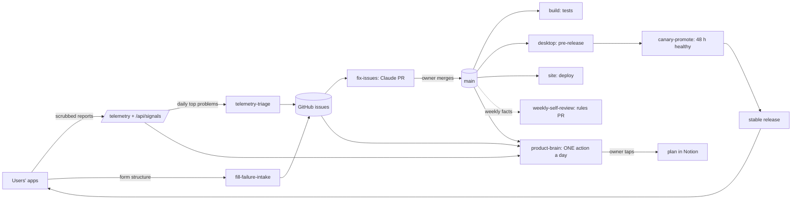

# How Job Pilotto runs itself

> **Read this first in a new session.** What runs on its own, when, what it may change, and where the owner
> approves. Every workflow in `.github/workflows/` must be listed here (`tests/test_how_it_runs.py` fails otherwise).

## 🧭 Strategy in 5 bullets
- **Positioning:** *fewer, better applications*: a job search that finds, scores, drafts and fills, for tech roles
  in Switzerland. Never mass-applies. → [Marketing Strategy — Free vs Premium](https://app.notion.com/p/3e862be8fd868172a5c7f1056b745d6e)
- **Model:** free app, source-available (FSL-1.1-ALv2); **Pro** (hosted searches, maintained employer index) on our servers.
- **Data:** the user's own accounts. Notion is the source of truth; keys stay encrypted on the Mac; no server holds job data.
- **Hard rules:** never auto-apply or press Submit; never scrape LinkedIn, Glassdoor, levels.fyi or Reddit; ask before
  spending money on AI; every manual fix becomes an app step (CLAUDE.md → Working rules).
- **Product vs personal:** the product (this repo, the website, releases) is shared; each user's schedules, Telegram bot and
  data run in *their* accounts. → [✨ Feature catalog](https://app.notion.com/p/3e962be8fd868133aa3ed99f1b0debcd) ·
  [🧠 How Job Pilotto learns](https://app.notion.com/p/3e562be8fd8681d89bd9e618ff7ea048)

## 🔁 How the loops connect

## ⚙️ Every automatic loop

| Loop | Trigger | Does | May change | Output | ✋ Owner gate |
|---|---|---|---|---|---|
| `build.yml` · CI · Tests | push / PR to main | Python, worker, desktop suites | nothing | red/green | — |
| `desktop.yml` · Release · Desktop app | push touching the app | builds Mac + Windows, signs, provenance, pre-release; prunes to 3 test builds; rebuilds main if workflows changed mid-build | releases | GitHub pre-release | promote (or canary) |
| `canary-promote.yml` · Canary | daily 09:17 UTC | promotes a pre-release 48 h old, green, used and healthy | the Latest release | stable → apps offer "Update to …" | variable `JOB_PILOTTO_AUTO_PROMOTE=on` |
| `site.yml` · Release · Website | push touching `site/` | deploys the website worker | the live site | jobpilotto.workers.dev | — |
| `telemetry-triage.yml` · App reports | website cron, daily | one issue per reported problem; Claude (Haiku) adds a likely cause | issues | `telemetry` issues | — |
| `fill-failure-intake.yml` · Form fills | app report → website | one issue per site + field, with a scrubbed snapshot | issues | `fill-failure` issues | — |
| `fix-issues.yml` · Fix automatically | daily 06:00 UTC | oldest open telemetry / fill-failure issue → Claude (Haiku) → tested fix | a branch + PR only | `autofix/issue-<n>` PR | merge the PR |
| `weekly-self-review.yml` | Sunday 18:00 UTC | reads the week's rework → ≤ 3 rule/skill edits | CLAUDE.md, AGENTS.md, skills (PR) | `self-review/<date>` PR | merge the PR |
| `product-brain.yml` · Product brain | daily 05:00 UTC | reads all signals → ONE recommended action | Notion Decisions only | Brain bot card | ✅ Explore, ✅ Approve |
| `daily.yml` · Find new jobs | user's private repo (every 4 h) | crawl, score, digest, kits | the user's Notion | Telegram digest | user submits |
| `scout.yml` · Find new employers | user's private repo (daily) | probes public job-feed APIs | employer list | Telegram | — |
| `mail.yml` · Gmail and Calendar | user's private repo (3× a day) | read-only mail → application events | the user's Notion | Telegram | — |

**In the app (every user):** Notion schema repair at start (`desktop/lib/schema.js`), data migrations (`migrate.js`),
weekly backup (`backup.js`), update check at start + every 6 h (`updater.js`), technical reports (`telemetry.js`,
off in Settings; never from `npm start`).

**For sessions (local):** `tools/pre-push-check.sh` blocks a push unless all suites + actionlint pass;
`tools/stop-test-check.sh` runs the touched suites before "done"; `CODEMAP.md` is kept fresh by a test.

## 🗂️ Where things live
- **Code map:** `CODEMAP.md` · **change loop:** CONTRIBUTING.md · **releases:** RELEASE.md · **rules:** CLAUDE.md
- **Notion (product):** Project Hub → Session Handoff (current state), Run Log, Decision Log, 🧭 Product Brain · Decisions
- **Numbers:** `/stats` (website), `/telemetry` (apps), `/api/signals` (both, JSON; the /stats key)
