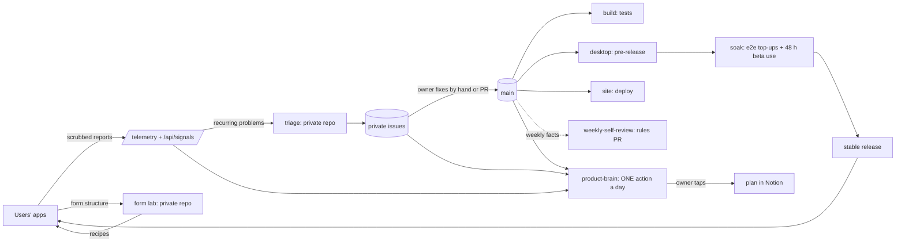

# How Job Pilotto runs itself

> **Read this first in a new session.** What runs on its own, when, what it may change, and where the owner
> approves. Every workflow in `.github/workflows/` must be listed here (`tests/test_how_it_runs.py` fails otherwise).
> The prompts of the product brain and the self-review are private (repo `GarryOne/job-pilotto-internal`, synced into secrets).

## 🧭 Strategy
Private: the owner's **📍 Product Compass** and **💰 IP & Monetization** in Notion (🧭 Strategy). Hard rules that shape
the code: never auto-apply or press Submit; never scrape LinkedIn, Glassdoor, levels.fyi or Reddit; ask before spending
money on AI; every manual fix becomes an app step (CLAUDE.md → Working rules).

## 🔁 How the loops connect

## ⚙️ Every automatic loop

| Loop | Trigger | Does | May change | Output | ✋ Owner gate |
|---|---|---|---|---|---|
| `build.yml` · CI · Tests | push / PR to main | Python, worker, desktop suites | nothing | red/green | — |
| `desktop.yml` · Release · Desktop app | nightly 04:00 Zurich (02:00 and 03:00 UTC, one of them goes on), only when the app changed; by hand | builds Mac + Windows, signs, provenance, pre-release; prunes to 3 test builds; rebuilds main if workflows changed mid-build | releases | GitHub pre-release | promote (or canary) |
| `windows-smoke.yml` · CI · Windows smoke | weekly (Mondays 06:17 UTC) | builds the Windows app from main and installs it on a fresh runner, with no release: runner or bundled-native drift shows up in a quiet week | main | screenshots (artifact) | — |
| `e2e-windows.yml` · CI · End-to-end on Windows | weekly (Mondays 06:47 UTC), or by hand with `suites` | runs the named suites (default `settings`, AI-free) on a Windows runner with the same harness; grows suite by suite as each is proven there. Never gates a release | red run + screenshots (artifact `e2e-artifacts-windows`) | the Actions page | secrets `E2E_*` as e2e.yml |
| `e2e.yml` · CI · End-to-end journey | **after the nightly build** (every suite on its commit; all green and `build.yml` green → it promotes the build to stable), **three times a day on main** (09:47, 13:47, 17:47 UTC; on a new commit; on an unchanged one it takes a second and a third look at another seeded path (only the suites that vary) and stops: 3 runs per commit at most), by hand, and on pushes to desktop/e2e or the extension (only the suites whose files changed) | four suites in parallel (wizard, jobs, interviews, settings), each from its own state in its own Notion test page, driving the real app on a Mac: the first-run path, Actions and Recent activity with a slow AI, Interviews, every Settings section | main | screenshots per suite (artifacts) | — |
| `ui-findings.yml` · CI · UI findings (producer) | after every e2e run (four a day), or by hand | files what the layout checks, the AI screenshot review and failed suite steps found as GitHub issues (labels for severity, kind, view, suite; the screenshot, the app's state, logs; "Seen again" and "Not seen" comments, the build tested on each; closes an issue after a second clean run, or the first when a commit says `Fixes #N`; probe issues close when the probe presses the same control again and it is fine) | issues, the evidence branch `pr-assets` | issues labelled `auto-ui` | a person marks real ones `confirmed`, false ones `wontfix-auto` |
| `ui-ranking.yml` · CI · Top issues list | when a loop issue is opened, closed, reopened or relabelled, or by hand | rebuilds the pinned "Top issues" list and the `priority:P0..P3` labels (order: priority, clean-last-run last, score × kind × critical path, Mac before Windows) | the pinned issue, `priority:` labels | the pinned list | nobody |
| `stable-canary.yml` · CI · Stable canary | daily 06:23 UTC, or by hand | runs the e2e journey on the **stable** tag (no paid AI judge) unless the gate passed on it in the last 20 h; red → one `stable-canary` issue (fix forward or roll back), green → closes it. Never files into the UI loop's backlog |
| `ui-fix.yml` · CI · UI fixer | daily 05:30 UTC, or by hand | picks the most critical ready issue (severity × sightings this week, `confirmed` doubles); Claude Code fixes it in `desktop/renderer` with a test first; guard + desktop tests; ONE pull request (at most 3 open) | a branch `auto-fix/<id>` | the pull request, with the screenshot as "Before" | owner merges the PR; nothing merges itself |
| `sentry-fix.yml` · CI · Sentry fixer | daily 06:30 UTC, or by hand | reads unresolved issues of Sentry `job-pilotto/job-pilotto-app`; keeps real (an `e2e` report only if tagged `expected:no`), fresh (≤ 7 days), error-level, not one-off, no PR in the last 14 days; Claude Code fixes the most critical with a test first; guard + desktop and Python tests; ONE pull request (at most 3 open) | a branch `sentry-fix/<short id>` | the pull request | owner merges the PR; nothing merges itself |
| `canary-promote.yml` · Release · Soak and promote | 01:17, 09:17, 17:17 UTC; by hand (dry run; `force_tag` + `force_reason` = the hot path, skips the soak) | with `JOB_PILOTTO_SOAK` on: end-to-end top-up runs on the candidate (about every 7 h), then `tools/canary_promote.py` decides: ≥ 48 h out, `build.yml` green, e2e green ≥ 3× over ≥ 24 h with no red among the last 3 and no open high-severity finding on its commit, no new telemetry problem, and healthy opt-in beta use (≥ 3 installs, ≥ 30 runs, no crash; thin evidence is only noted until `JOB_PILOTTO_REQUIRE_BETA` is on). Unproven after 5 days → a `release-decision` issue. Every run also relabels the releases (`tools/sync_release_labels.py`: ✅ STABLE · 🧪 BETA (release candidate) · 🔨 Build · 📦 Previous stable) and updates the pinned "Release channels" issue | the Latest release only when `JOB_PILOTTO_AUTO_PROMOTE` is `on` | the decision in the run summary | variables `JOB_PILOTTO_SOAK`, `JOB_PILOTTO_AUTO_PROMOTE`, `JOB_PILOTTO_REQUIRE_BETA`, secret `JOB_PILOTTO_TELEMETRY_KEY` |
| `site.yml` · Release · Website | push touching `site/` | deploys the website worker | the live site | jobpilotto.workers.dev | — |
| `site-next.yml` · Release · Website preview (next) | push touching `site-next/` | deploys the preview worker | the website preview (no data of its own) | next.jobpilotto.workers.dev | — |
| Form lab · private repo `GarryOne/job-pilotto-internal` (`form-lab.yml`, daily 04:17 UTC) | headless browser on public application forms with a test applicant (never submits), aimed by the site's plan → success per board and control; tries candidate recipes | the site's recipe and lab tables (`/api/lab`, `/api/recipes`) | a recipe gets a 5% canary when it works on enough pages | disable any recipe on the site |
| Triage · private repo `GarryOne/job-pilotto-internal` (`triage.yml`, daily 05:47 UTC) | pulls recurring problems from the site's queue (several installs, or very often) → one issue per problem in the private repo | issues (private) | `telemetry` / `fill-failure` issues there | act on the issue |
| `weekly-self-review.yml` | Sunday 18:00 UTC | reads the week's rework → ≤ 3 rule/skill edits | CLAUDE.md, AGENTS.md, skills (PR) | `self-review/<date>` PR | merge the PR |
| `product-brain.yml` · Product brain | daily 05:00 UTC; Sunday 16:00 strategy review | reads the owner's 📍 Product Compass, numbers, the website (screenshots), GitHub → ONE action serving the phase; Sunday: proposes Compass changes (Opus, web) | Notion Decisions (+ Compass on ✅) | Brain bot card | ✅ Explore, ✅ Approve, ✅ Update the compass |
| `daily.yml` · Find new jobs | user's private repo (every 4 h) | crawl, score, digest, kits | the user's Notion | Telegram digest | user submits |
| `scout.yml` · Find new employers | user's private repo, **optional** (off for new installs) | probes public job-feed APIs | the user's employer list | Telegram | — |
| `central-scout.yml` · Central scout | private repo `GarryOne/job-pilotto-internal` (daily; with Common Crawl board discovery, learned priorities and a weekly Swiss canary, all private) | runs the public engine's scout with no user data, verifies every feed, uploads the index to the website (`PUT /api/index`, secret `INDEX_PUBLISH_KEY`) | the shared employer index (KV) | apps and Always-on runs download it (worldwide feeds with the places they hire in; each install crawls only feeds with roles in *its own* `search.json` places, `JOB_PILOTTO_INDEX_ALL=1` for all): `GET /api/index`, at most daily, cached, merged with the starter `config/sources.json`; API down → cache/starter, a run never fails | — |
| `mail.yml` · Gmail and Calendar | user's private repo (3× a day) | read-only mail → application events | the user's Notion | Telegram | — |

**Employer index (Stage 1, step E):** the index is product data on our service (Cloudflare KV, `site/src/employers.js`), not
in anyone's Notion; nothing of the user goes up (a plain GET). Clients: `src/employer_index.py`. The owner's Notion
Employers & Sources keeps working on top of it.

**In the app (every user):** Notion schema repair at start (`desktop/lib/schema.js`), data migrations (`migrate.js`),
weekly backup (`backup.js`), update check at start + every 6 h (`updater.js`), technical reports (`telemetry.js`,
off in Settings; never from `npm start`).

**For sessions (local):** `tools/pre-push-check.sh` blocks a push unless all suites + actionlint pass;
`tools/stop-test-check.sh` runs the touched suites before "done"; `CODEMAP.md` is kept fresh by a test.

## 🗂️ Where things live
- **Code map:** `CODEMAP.md` · **change loop:** CONTRIBUTING.md · **releases:** RELEASE.md · **rules:** CLAUDE.md
- **Notion (product):** Project Hub → Session Handoff (current state), Run Log, Decision Log, 🧭 Product Brain · Decisions
- **Numbers:** `/stats` (website), `/telemetry` (apps), `/api/signals` (both, JSON; the /stats key)
